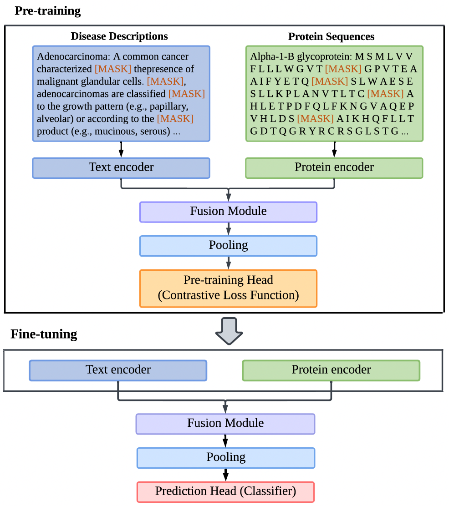
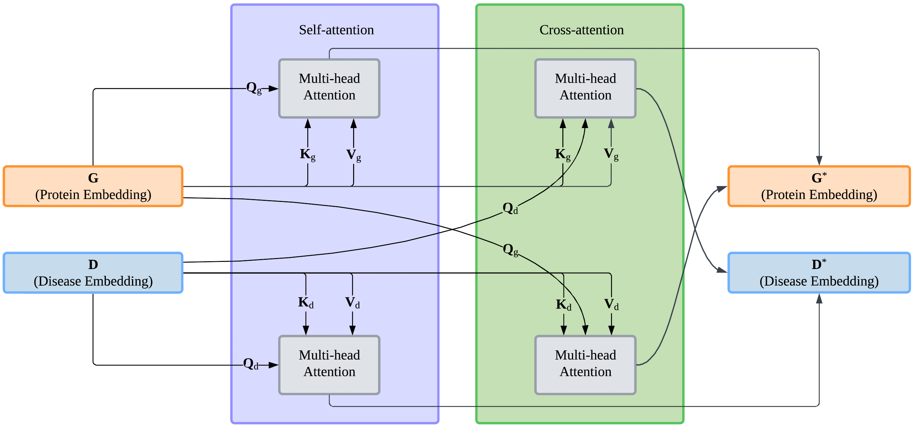

# Heterogeneous biomedical entity representation learning for gene-disease association prediction

<div align="left">

[](https://academic.oup.com/bib/article/25/5/bbae380/7735275)
[](https://huggingface.co/spaces/Gla-AI4BioMed-Lab/FusionGDA)

</div>

The FusionGDA model utilises a fusion module to enrich the gene and disease semantic representations encoded by pre-trained language models for GDA prediction.

## Framework and Fusion Module

<div style="display: flex; align-items: center;">
    
    
</div>


## Installation

```bash
# Download the latest Anaconda installer
wget https://repo.anaconda.com/archive/Anaconda3-latest-Linux-x86_64.sh

# Install Anaconda
bash Anaconda3-latest-Linux-x86_64.sh -b

# Clean up the installer to save space
rm Anaconda3-latest-Linux-x86_64.sh

# Set path to conda
ENV PATH /root/anaconda3/bin:$PATH

# Updating Anaconda packages
conda update --all

# Install the latest version of PyTorch and related libraries with CUDA support
# Note: Replace 'cudatoolkit=x.x' with the version compatible with your CUDA version
RUN conda install pytorch torchvision torchaudio cudatoolkit=11.3 -c pytorch

# Install other Python packages
pip install pytdc
pip install wandb
pip install lightgbm
pip install -U adapter-transformers
pip install pytorch-metric-learning
```

## Executing program

Make sure you are in the directory ~/dpa_pretrain/scripts
You adjust the required parameters directly.

###  Pre-training phase
```
bash run_pretrain_gda_ml_adapter_infoNCE.sh
```
###  Fine-tuning phase
TDC Dataset
```
bash run_finetune_gda_lightgbm_infoNCE_tdc.sh
```
DisGeNET Dataset
```
bash run_finetune_gda_lightgbm_infoNCE.sh
```
Check your results in the wandb account.

## Datasets

We store all required datasets in the Drive. [Here](https://gla-my.sharepoint.com/:u:/g/personal/2582280m_student_gla_ac_uk/EejupegKNtFIiyrdb_3B7nYB7RuHgmoxio-IHIwaoyaS2w)

## Citation
Please cite our [paper](https://academic.oup.com/bib/article/25/5/bbae380/7735275) if you find our work useful in your own research.
```
@article{meng2024heterogeneous,
  title={Heterogeneous biomedical entity representation learning for gene-disease association prediction},
  author={Meng, Zhaohan and Liu, Siwei and Liang, Shangsong and Jani, Bhautesh and Meng, Zaiqiao},
  journal={Briefings in Bioinformatics},
  volume={25},
  number={5},
  pages={bbae380},
  year={2024},
  publisher={Oxford University Press}
}
```


